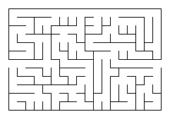

# Maze Tools in Go
This is a collection of mazes and tools based on the book *Mazes for Programmers* by Jamis Buck.

## Algorithms:
* Binary Tree
* SideWinder

## Tools:
* ASCII Renderer
* Unicode Renderer
* Image Renderer

## Examples: 

### ASCII
```
+---+---+---+---+---+---+---+---+
|                               |
+---+---+   +   +   +   +   +---+
|           |   |   |   |       |
+---+   +---+---+   +   +   +---+
|               |   |   |       |
+   +   +   +---+   +   +   +   +
|   |   |   |       |   |   |   |
+---+---+---+---+---+---+---+---+
```

### Unicode
```
┏━━━━━━━━━━━━━━━━━━━━━━━━━━━━━━━━━━━━━━━━━━━━━━━━━━━━━━━━━━━┓
┃                                                           ┃
┣━━━━━━━━   ┃   ━━━━┳━━━━   ━━━━┳━━━━━━━━   ━━━━┓   ━━━━━━━━┫
┃           ┃       ┃           ┃               ┃           ┃
┃   ┃   ━━━━┫   ┏━━━┻━━━━   ━━━━┫   ┃   ┏━━━━━━━┛   ━━━━━━━━┫
┃   ┃       ┃   ┃               ┃   ┃   ┃                   ┃
┣━━━┛   ┏━━━┛   ┗━━━━━━━┓   ┏━━━┛   ┗━━━┫   ┃   ┃   ┃   ┃   ┃
┃       ┃               ┃   ┃           ┃   ┃   ┃   ┃   ┃   ┃
┃   ━━━━┫   ━━━━━━━━┓   ┗━━━╋━━━━   ━━━━┻━━━┫   ┗━━━┻━━━┻━━━┫
┃       ┃           ┃       ┃               ┃               ┃
┃   ┃   ┣━━━━   ┏━━━┛   ┃   ┗━━━┓   ┃   ┃   ┗━━━┓   ┃   ┃   ┃
┃   ┃   ┃       ┃       ┃       ┃   ┃   ┃       ┃   ┃   ┃   ┃
┃   ┃   ┃   ┃   ┣━━━━━━━┛   ━━━━┻━━━┻━━━┫   ━━━━┻━━━┫   ┃   ┃
┃   ┃   ┃   ┃   ┃                       ┃           ┃   ┃   ┃
┃   ┃   ┗━━━┫   ┃   ━━━━┓   ━━━━━━━━━━━━┻━━━┓   ━━━━┻━━━┫   ┃
┃   ┃       ┃   ┃       ┃                   ┃           ┃   ┃
┗━━━┻━━━━━━━┻━━━┻━━━━━━━┻━━━━━━━━━━━━━━━━━━━┻━━━━━━━━━━━┻━━━┛
```

### PNG
